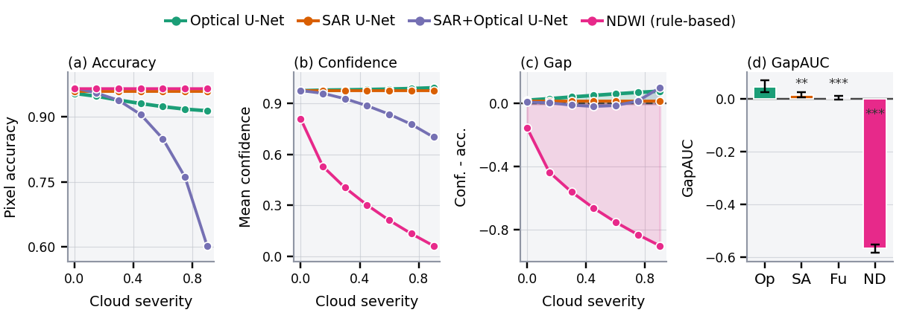
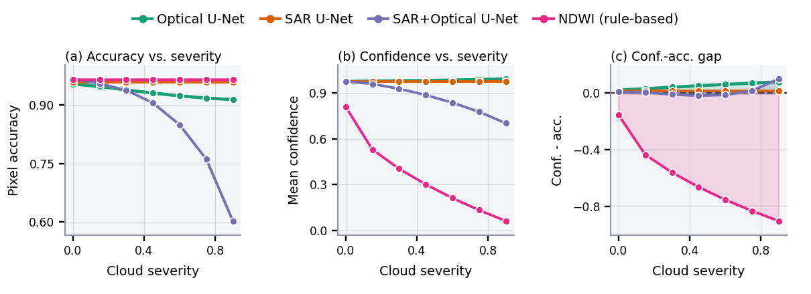
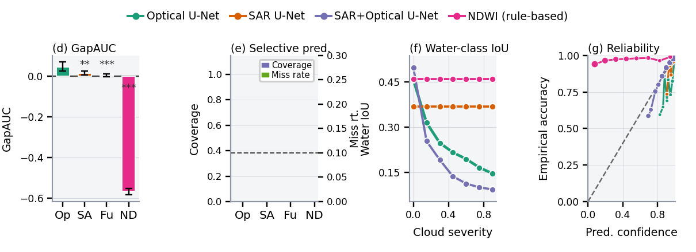
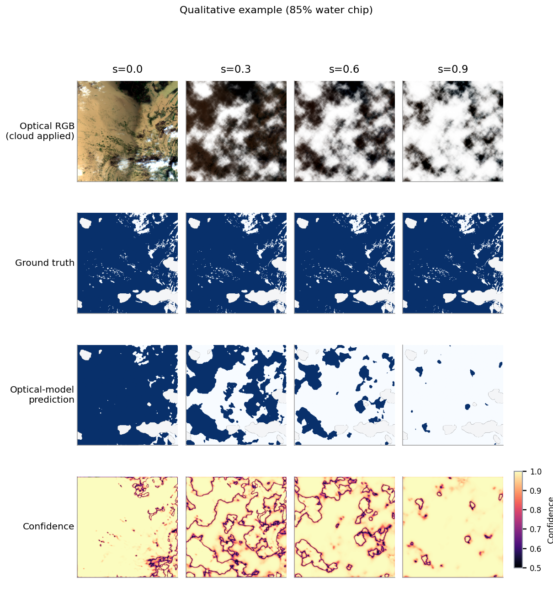
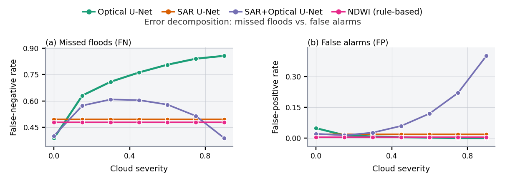
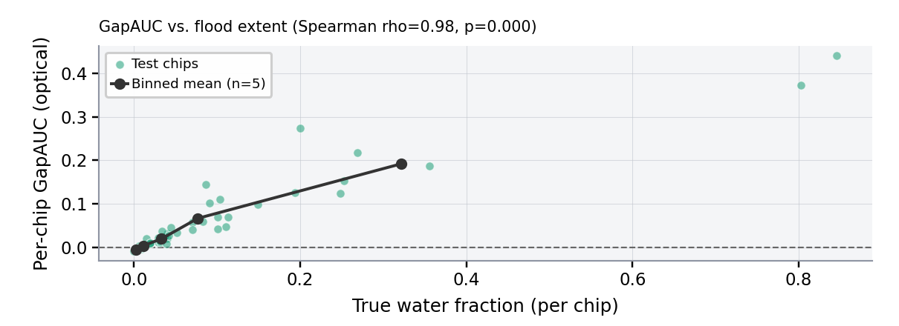

<div align="center">

# Does Confidence Track Visibility?
### Diagnosing Blind Confidence in Cloud-Occluded Flood Segmentation

*Anonymous submission — NeurIPS 2026 Workshop on Tackling Climate Change with Machine Learning*

[](LICENSE)
[](#requirements)
[](#reproducing-the-results)

</div>

---

## Overview

Optical flood-mapping models are least reliable exactly when they are most needed: heavy cloud cover coincides with the monsoon and cyclone seasons that produce the floods these models are built to detect. This repository contains the full, self-contained pipeline behind our paper, which asks one narrow, falsifiable question:

> **Does a model's predicted confidence track the real information loss caused by cloud occlusion, or does it stay artificially high as the model's actual skill collapses?**

We build a controlled cloud-severity ladder over real Sentinel-1 / Sentinel-2 chips from [Sen1Floods11](https://github.com/cloudtostreet/Sen1Floods11) and evaluate four flood classifiers — an optical U-Net, a cloud-invariant SAR U-Net, an early-fusion SAR+optical U-Net, and a classical NDWI rule — across seven synthetic cloud severities. Everything in this repository — data pooling, training, evaluation, all statistical tests, and every figure and table in the paper — runs end to end from a single notebook on one free-tier GPU in under an hour.

**Headline findings**

| | Finding |
|---|---|
| **H1** | The optical model's confidence–accuracy gap (GapAUC) is significantly positive (`+0.047`, 95% CI `[+0.027, +0.070]`); water-class IoU collapses from `0.457` to `0.146` under heavy cloud while raw accuracy barely moves. |
| **H2** | SAR's gap is an order of magnitude smaller — the cloud-invariance control the design predicts. SAR+optical fusion's gap looks *better calibrated* than optical alone, but a false-negative/false-positive decomposition shows this masks a sharp rise in false alarms, not genuine robustness. |
| **H3** | A per-severity selective-prediction layer targeting a 10% missed-flood rate certifies **no threshold at any severity for any model** — a negative result we trace to insufficient model accuracy at pilot scale, not the calibration procedure, and report as such rather than hide it. |

Every claim above is reproducible from the artifacts in [`results/`](results/) and re-derivable from [`notebooks/blind_confidence_flood.ipynb`](notebooks/blind_confidence_flood.ipynb).

<p align="center">
  
</p>

---

## Repository structure

```
.
├── notebooks/
│   └── blind_confidence_flood.ipynb   # the full pipeline: data → training → evaluation → figures/tables
│                                       # (this exact executed notebook produced every result in results/)
├── paper/
│   ├── main.tex                       # paper source (NeurIPS 2026 workshop format)
│   ├── references.bib
│   ├── neurips_2026.sty
│   └── figures/                       # vector figures as embedded in the paper
├── results/
│   ├── figures/                       # all 8 generated figures, .pdf (vector) + .png
│   ├── tables/                        # all 3 result tables, .csv + .tex
│   └── logs/
│       └── results_summary.json       # single source of truth for every number in the paper
├── requirements.txt
├── LICENSE
└── README.md
```

---

## Method, in one paragraph

For each chip's optical bands we generate a smooth, multi-octave opacity field, thresholded so its mean tracks a target severity $s \in \{0.00, 0.15, \ldots, 0.90\}$, and composite it toward a bright cloud-reflectance constant — radar bands are never touched, which is what makes the SAR model a genuine control rather than another treatment arm. Three lightweight U-Nets (ResNet-18 encoder) are trained identically on *clean* chips only — SAR (VV, VH), Optical (Blue, Green, Red, NIR), and early-fusion of both — so any behavioral difference under synthetic cloud at test time is attributable to architecture and modality, not differential training exposure. A fourth, non-learned baseline applies the classical NDWI rule directly. **GapAUC** — the trapezoidal integral of (confidence − accuracy) over the severity ladder — is our primary diagnostic, with chip-clustered bootstrap confidence intervals and a permutation test with Bonferroni correction. A **selective-prediction** layer built on an exact Clopper–Pearson finite-sample bound asks whether confidence can be turned into a certified abstention rule, per severity. Full derivations, the formal proposition and proof, and every ablation are in the paper's appendix.

## Data

We use the `HandLabeled` subset of [Sen1Floods11](https://github.com/cloudtostreet/Sen1Floods11) (Bonafilia et al., CC-BY license), pooling all three official splits into 431 candidate chips, dropping 4 with no valid ground truth, and re-splitting 60/20/20 (fixed seed) into **189 train / 63 validation / 64 test** chips spanning ten flood events across five continents. The notebook auto-downloads the dataset from its public Google Cloud Storage bucket — no manual download step is required. Full band structure, preprocessing, and the exact excluded-chip IDs are documented in the paper appendix and reproduced in the notebook's markdown cells.

## Requirements

```
python >= 3.10
torch
segmentation-models-pytorch
rasterio
numpy
pandas
scipy
matplotlib
tqdm
```

See [`requirements.txt`](requirements.txt) for a pinned environment. The notebook is designed for a single T4-class GPU (Google Colab / Kaggle free tier); it also runs on CPU for the dry-run mode described below, just slower.

## Reproducing the results

The notebook has a single configuration cell controlling every run parameter. **Run it in `DRY_RUN` mode first** — it substitutes tiny synthetic data so every code path executes in under a minute, including two deliberately injected edge cases (a chip with zero valid ground truth, and non-finite Sentinel-1 values) that earlier iterations of this pipeline did not handle correctly and now do:

```python
DRY_RUN = True    # start here — synthetic smoke test, no download, ~1 minute
```

Once that passes, set `DRY_RUN = False` and run top to bottom for the real pipeline (data download → training → evaluation → statistics → all figures and tables). Total wall-clock time for training all three models is **103 seconds**; the full pipeline including data download and every statistical test runs in well under one GPU-hour.

| Parameter | Value |
|---|---|
| Chip cap / usable chips | 320 / 316 |
| Train / val / test | 189 / 63 / 64 |
| Image size | 512 → 256 px |
| Epochs | 20 |
| Batch size | 8 |
| Optimizer | AdamW, lr = 1e-3, weight decay = 1e-4 |
| Severity grid | 7 levels, 0.00 → 0.90 |
| Bootstrap / permutation resamples | 2,000 / 20,000 |
| Random seed | 42 (single seed — see *Limitations*) |

The full hyperparameter and reproducibility reference — every value used to produce the paper's results in one place — is Table 6 in the paper appendix.

## Results

### GapAUC by model

| Model | GapAUC | 95% CI | *p* vs. optical |
|---|---:|:---:|---:|
| Optical U-Net | **+0.047** | [+0.027, +0.070] | — |
| SAR U-Net | +0.014 | [+0.006, +0.025] | 0.0056 |
| SAR+Optical U-Net (fusion) | +0.006 | [−0.001, +0.013] | <0.001 |
| NDWI (rule-based) | **−0.566** | [−0.583, −0.551] | <0.001 |

### Pixel accuracy vs. water-class IoU/F1 (representative severities)

| Model | Acc @ s=0 | Acc @ s=0.9 | IoU @ s=0 | IoU @ s=0.9 |
|---|---:|---:|---:|---:|
| Optical | 0.955 | 0.914 | 0.457 | 0.146 |
| SAR | 0.959 | 0.959 | 0.369 | 0.369 |
| Fusion | 0.968 | 0.602 | 0.498 | 0.093 |
| NDWI | 0.966 | 0.966 | 0.460 | 0.460 |

Raw accuracy barely moves for the optical model while water-class IoU collapses — the whole reason the paper reports IoU as the primary damage metric, not accuracy. Full per-severity tables (all 7 points, not just the 3 shown here) are in the paper appendix and in [`results/tables/`](results/tables/).

### Figures

| | | |
|:---:|:---:|:---:|
|  |  |  |
| Panel overview | Severity curves (detail) | Diagnostics: GapAUC, selective prediction, IoU, reliability |
|  |  |  |
| Qualitative example on real imagery | False-negative / false-positive decomposition | GapAUC vs. flood extent |

All 8 figures, as vector PDF and PNG, are in [`results/figures/`](results/figures/).

## Honest limitations

We say this plainly rather than let a reader discover it unprompted: every result here comes from a **single training run with one fixed random seed** — there is no multi-seed ablation, and the fusion false-positive pattern in particular should be confirmed with a longer training budget and multiple seeds before being read as a stable property rather than one realization of a stochastic process. The cloud-occlusion model is a controlled synthetic composite, not a naturally occurring cloud mask (Sen1Floods11 ships none for its optical layer), and we document a verified mathematical property of our specific compositing scheme that makes one baseline's (NDWI) accuracy artificially flat under our synthetic cloud — this is disclosed in full in the paper, not smoothed over. All findings are specific to lightweight U-Nets trained on 189 chips at pilot scale; we make no claim beyond that scale. Full discussion is in the paper's Limitations section and appendix.

## Citation

This repository accompanies an anonymous submission under double-blind review. Citation details will be added upon de-anonymization; please do not cite this repository by URL in a way that would compromise the review process.

## License

Code in this repository is released under the [MIT License](LICENSE). The Sen1Floods11 dataset is CC-BY licensed by its original authors and is not redistributed here — the notebook downloads it directly from its public source.
